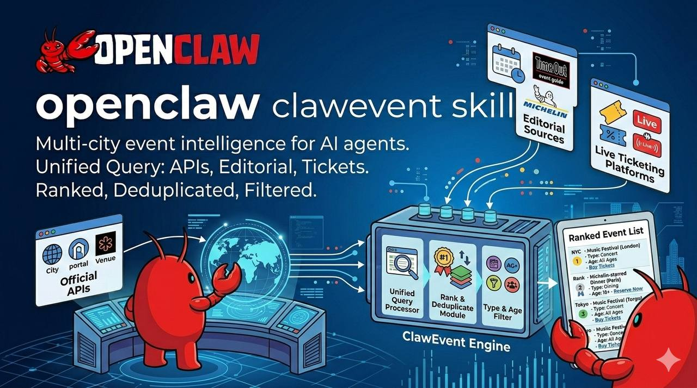

<p align="center">
  
</p>

<h1 align="center">🎉 ClawEvents</h1>
<h3 align="center">Multi-City Event Intelligence for AI Agents</h3>

<p align="center">
  <strong>Multi-city event intelligence for AI agents.</strong><br/>
  Unified Query: APIs, Editorial, Tickets.<br/>
  Ranked, Deduplicated, Filtered.
</p>

<p align="center">
  One query across official city APIs, editorial sources (Time Out), and live ticketing platforms<br/>
  returns ranked, deduplicated results filtered by type, age group, and time of day —<br/>
  across <strong>Tel Aviv</strong>, <strong>Barcelona</strong>, <strong>New York</strong>, and <strong>Bucharest</strong>.
</p>

<div align="center">

[](LICENSE)
[](https://github.com/yhyatt/clawevents)
[](https://clawhub.ai/skills/clawevents)
[](https://github.com/yhyatt/clawevents)

</div>

<p align="center">
  <a href="#-openclaw-friendly">OpenClaw 🦞</a> •
  <a href="#-quick-start">Quick Start</a> •
  <a href="#-sources">Sources</a> •
  <a href="#-filters">Filters</a> •
  <a href="#-api-keys">API Keys</a> •
  <a href="#-architecture">Architecture</a> •
  <a href="#-extending">Extending</a>
</p>

---

## 🦞 OpenClaw Friendly

ClawEvents is designed to be invoked entirely by an AI agent. Install the skill from [ClaWHub](https://clawhub.ai/skills/clawevents), then just ask:

> *"What's on in Tel Aviv this weekend?"*
> *"Find jazz concerts in Barcelona next week."*
> *"Free family events in NYC on Saturday afternoon."*
> *"What's happening in Bucharest on March 27?"*

Your agent handles the rest — multi-source query, dedup, rank, and returns a clean list.

---

## ✨ Features

<table>
<tr>
<td width="50%">

### 🌍 Multi-City
- **Tel Aviv** — TLV Municipality API (DigiTel), Eventbrite, Lev Cinema, Time Out IL
- **Barcelona** — Ticketmaster, Eventbrite, Fever, Xceed (clubs/nightlife)
- **New York** — Ticketmaster, Eventbrite, NYC Open Data, Fever
- **Bucharest** — iaBilet.ro (Romanian ticketing), Songkick (concerts), RA (nightlife/electronic)

</td>
<td width="50%">

### 🎯 Smart Filtering
- **Type:** jazz, concert, cinema, theatre, nightlife, family, comedy, art, sport, festival
- **Age group:** kids, family, adults
- **Time of day:** morning, afternoon, evening, late-night
- **Date range, free-only, limit**

</td>
</tr>
<tr>
<td width="50%">

### ⚡ Parallel Fetching
- All sources fetched concurrently via `ThreadPoolExecutor`
- Graceful per-source failure (one source down = others still return)
- Browser-based scrapers (Playwright) are opt-in

</td>
<td width="50%">

### 🔁 Ranked & Deduped
- Cross-source deduplication (same event from Ticketmaster + Eventbrite = one result)
- Chronological ranking, no-time events last
- JSON or human-readable text output

</td>
</tr>
</table>

---

## 🚀 Quick Start

```bash
pip install clawevents

# For browser-based scrapers (Time Out IL, Fever, Xceed):
pip install clawevents[browser]
playwright install chromium
```

```bash
# Jazz in Tel Aviv this week
clawevents search --city tel-aviv --type jazz --days 7

# Cinema tonight (Lev + others)
clawevents search --city tel-aviv --type cinema --days 1

# Multi-city weekend
clawevents search --city barcelona new-york --days 3

# Free family events, afternoon
clawevents search --city tel-aviv --type family --age family --time afternoon --free

# Evening concerts in Bucharest
clawevents search --city bucharest --type concert --time evening --days 7

# Nightlife in Bucharest this weekend (RA + Songkick)
clawevents search --city bucharest --type nightlife --days 3

# Evening concerts, adults, specific dates
clawevents search --city tel-aviv barcelona --type concert --age adults --time evening \
  --from 2026-06-21 --to 2026-06-27

# JSON output (for programmatic use)
clawevents search --city new-york --type jazz --format json --limit 10
```

---

## 🗂 Sources

### Tel Aviv 🇮🇱

| Source | Coverage | Requires |
|--------|----------|---------|
| **TLV Municipality API** | Official city events (DigiTel source) | `TLV_API_KEY` (optional — scrape fallback) |
| **Eventbrite** | Tech, community, cultural events | `EVENTBRITE_TOKEN` |
| **Lev Cinema** | Boutique cinema, Dizengoff | None |
| **Time Out IL** | Jazz, nightlife, theatre editorial picks | Playwright |

### Barcelona 🇪🇸

| Source | Coverage | Requires |
|--------|----------|---------|
| **Ticketmaster** | Concerts, theatre, sports | `TICKETMASTER_API_KEY` |
| **Eventbrite** | Community + cultural events | `EVENTBRITE_TOKEN` |
| **Fever** | Experiences, immersive, concerts | Playwright |
| **Xceed** | Clubs, nightlife (Pacha, Razzmatazz, Apolo) | Playwright |

### New York 🗽

| Source | Coverage | Requires |
|--------|----------|---------|
| **Ticketmaster** | Concerts, Broadway, sports | `TICKETMASTER_API_KEY` |
| **Eventbrite** | Community + cultural events | `EVENTBRITE_TOKEN` |
| **NYC Open Data** | Free parks + city events | None |
| **Fever** | Experiences, immersive | Playwright |

### Bucharest 🇷🇴

| Source | Coverage | Requires |
|--------|----------|---------|
| **iaBilet.ro** | Concerts, theatre, comedy, standup, exhibitions (dominant Romanian ticketing platform) | None (HTML scrape) |
| **Songkick** | International + local concerts | None (HTML scrape) · `SONGKICK_API_KEY` (optional, more results) |
| **Resident Advisor (RA)** | Electronic music, nightlife, club events (GraphQL API) | None |

> **Note:** iaBilet.ro is the largest Romanian ticketing platform with 2,500+ events. RA area ID for Bucharest is **381** (verified). Songkick metro ID is **31841**.

---

## 🔑 API Keys

All keys are **free**:

| Variable | Signup | Unlocks |
|----------|--------|---------|
| `TICKETMASTER_API_KEY` | [developer.ticketmaster.com](https://developer.ticketmaster.com) | Barcelona + NYC (230K+ events) |
| `EVENTBRITE_TOKEN` | [eventbrite.com/platform/api](https://www.eventbrite.com/platform/api) | All cities |
| `TLV_API_KEY` | [apiportal.tel-aviv.gov.il](https://apiportal.tel-aviv.gov.il) | Official TLV events (optional) |
| `SONGKICK_API_KEY` | [songkick.com/api_key_requests](https://www.songkick.com/api_key_requests) | More Songkick results (optional) |

```bash
export TICKETMASTER_API_KEY="..."
export EVENTBRITE_TOKEN="..."
export TLV_API_KEY="..."          # optional
export SONGKICK_API_KEY="..."     # optional
```

---

## 🎛 Filters

| Flag | Values | Default |
|------|--------|---------|
| `--city` / `-c` | `tel-aviv` `tlv` · `barcelona` `bcn` · `new-york` `nyc` · `bucharest` `buc` | required |
| `--type` / `-t` | `jazz` `concert` `cinema` `theatre` `nightlife` `family` `comedy` `art` `sport` `festival` | all |
| `--age` | `kids` `family` `adults` | all |
| `--time` | `morning` `afternoon` `evening` `late-night` | all |
| `--from` / `--to` | `YYYY-MM-DD` | today / +7 days |
| `--days` | integer | `7` |
| `--free` | flag | `false` |
| `--limit` / `-n` | integer | `20` |
| `--format` | `text` `json` | `text` |

---

## 🏗 Architecture

```
ClawEventsEngine
├── City Registry (city_registry.py)
│   └── Declarative per-city config: fetchers, platforms, IDs — adding a city = data change only
├── Parallel fetchers (ThreadPoolExecutor, per city)
│   ├── API-based    Ticketmaster · Eventbrite · TLV Municipality · NYC Open Data · RA (GraphQL)
│   ├── Scrape       iaBilet.ro · Songkick  (BeautifulSoup, graceful 403 fallback)
│   └── Browser      Time Out IL · Fever · Xceed  (opt-in, requires Playwright)
├── Filter     city · type · age · time-of-day · date range · free
├── Dedup      same title + start time across sources → one result
└── Rank       chronological (events without time go last)
```

---

## 🔌 Use in Python

```python
from clawevents import ClawEventsEngine, City, EventType, AgeGroup, TimeOfDay
from datetime import datetime, timedelta

engine = ClawEventsEngine()
events = engine.search(
    cities=[City.BUCHAREST],
    event_types=[EventType.NIGHTLIFE, EventType.CONCERT],
    start=datetime(2026, 3, 27),
    end=datetime(2026, 3, 28),
    age_groups=[AgeGroup.ADULTS],
    limit=10,
)
for e in events:
    print(e.title, e.start, e.venue_name, e.price_display)
```

---

## 🧩 Extending

New cities use the declarative city registry — no code changes needed for common fetchers:

```python
# city_registry.py — add a new city
"berlin": CityConfig(
    name="Berlin",
    slug="berlin",
    aliases=["berlin"],
    country="DE",
    timezone="Europe/Berlin",
    event_fetchers=["songkick", "ra", "eventbrite"],
    reservation_platforms=["thefork", "opentable"],
    ...
)
```

For a custom source:

```python
# 1. Create clawevents/fetchers/my_source.py
from clawevents.fetchers.base import BaseFetcher
from clawevents.models import City, Event, EventType

class MyFetcher(BaseFetcher):
    source_name = "my_source"
    supported_cities = [City.TEL_AVIV]

    def fetch(self, city, start, end, event_types=None, limit=50):
        # return List[Event]
        ...
```

```python
# 2. Register in engine.py
_FETCHER_REGISTRY["my_source"] = MyFetcher
_CITY_FETCHERS[City.TEL_AVIV].append("my_source")
```

```python
# 3. Export in fetchers/__init__.py
from .my_source import MyFetcher
```

---

## 📄 License

MIT — see [LICENSE](LICENSE)
